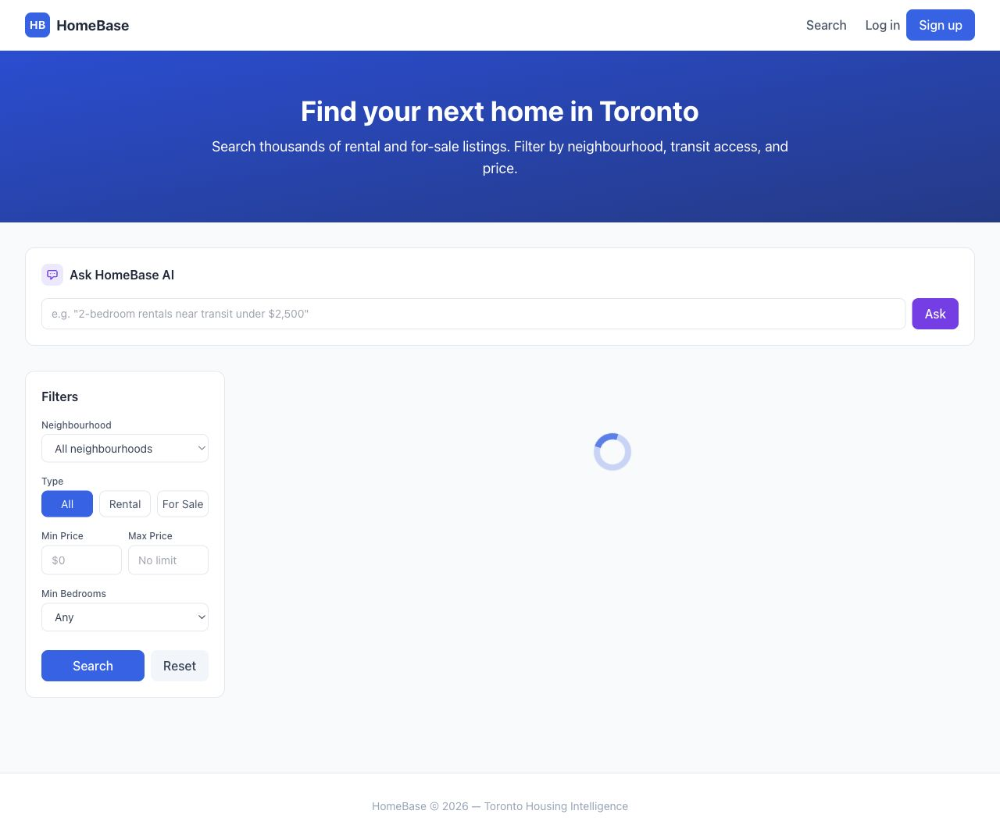
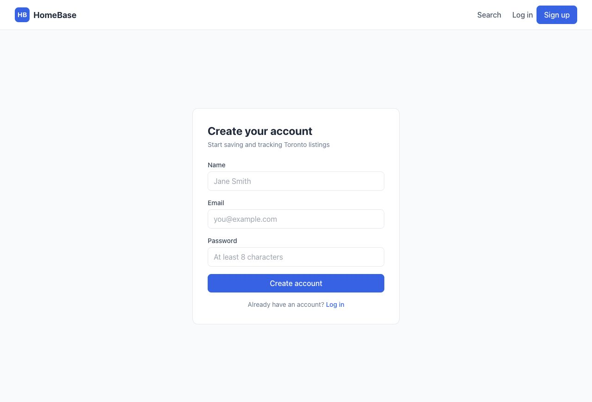
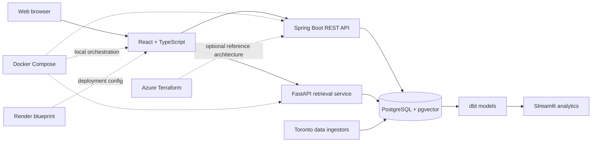

# Homebase

[](https://github.com/beaprogram/Homebase/actions/workflows/ci.yml)

A full-stack housing search platform for Toronto renters and buyers. Homebase combines structured listing filters, saved listings, JWT authentication, and a natural-language retrieval service in one repository.

## Product preview

| Search and AI interface | Account creation |
|---|---|
|  |  |

The [public frontend preview](https://homebase-frontend-54zw.onrender.com) demonstrates the current UI. API-backed listings, authentication, and AI responses require active backend, database, and AI services; the previous public backend URL was not healthy when this README was updated. The repository's Docker Compose setup is the reproducible way to evaluate the complete stack.

## What is implemented

| Area | Current repository evidence |
|---|---|
| Web client | React and TypeScript pages for search, listing details, registration, login, and saved listings |
| REST API | Spring Boot controllers and services for authentication, listings, filters, and saved listings |
| Data | PostgreSQL schema and Flyway migrations, including seeded listings and pgvector support |
| Applied AI | FastAPI `/ask` endpoint with embedding, retrieval, and Claude integration modules |
| Analytics | Python ingestion, dbt staging/mart models, a Prefect flow, and a Streamlit dashboard |
| Quality | JUnit/Mockito, Vitest/Testing Library, pytest, and Playwright suites |
| Delivery | Dockerfiles, Docker Compose, a Render blueprint, GitHub Actions CI, and optional Azure Terraform |

## Architecture



Solid lines describe application and data flows present in the code. Dotted lines describe delivery configuration. The Azure resources under `infra/` are an optional reference architecture; this repository does not claim that they are currently deployed.

## Technology

| Layer | Tools |
|---|---|
| Frontend | React 18, TypeScript, Vite, Tailwind CSS, TanStack Query, Zustand |
| Backend | Java 21, Spring Boot 3.3, Spring Data JPA, Spring Security, OpenAPI |
| AI service | Python 3.12, FastAPI, sentence-transformers, Anthropic API |
| Data | PostgreSQL 16, pgvector, Flyway, dbt, Prefect, Streamlit |
| Testing | JUnit, Mockito, Vitest, Testing Library, pytest, Playwright |
| Delivery | Docker, Docker Compose, GitHub Actions, Render, Terraform |

## Run locally

### Prerequisites

- Docker with Docker Compose
- An Anthropic API key only if you want generated AI answers

```bash
git clone https://github.com/beaprogram/Homebase.git
cd Homebase
cp .env.example .env
# Add ANTHROPIC_API_KEY to .env if needed.
docker compose up --build
```

After the services are healthy:

- Frontend: `http://localhost:3000`
- Backend API docs: `http://localhost:8080/swagger-ui.html`
- AI service docs: `http://localhost:8000/docs`

To stop the stack, run `docker compose down`. Add `-v` only when you intentionally want to delete the local database volume.

## API overview

```text
POST   /api/auth/register
POST   /api/auth/login
GET    /api/listings
GET    /api/listings/{id}
GET    /api/saved-listings
POST   /api/saved-listings/{listingId}
DELETE /api/saved-listings/{listingId}

POST   /ask                    # AI service
```

The running backend exposes the complete OpenAPI contract at `/v3/api-docs` and Swagger UI at `/swagger-ui.html`.

## Run the checks

```bash
# Backend
cd backend
mvn test

# Frontend
cd ../frontend
npm ci
npm test
npm run build

# AI service
cd ../ai-service
python -m pip install -r requirements.txt
pytest

# Ingestion
cd ../data/ingestion
python -m pip install -r requirements.txt
pytest
```

The GitHub Actions workflow runs these independent checks on pull requests and pushes to `main`.

## Data and analytics

The repository includes Toronto Open Data and transit ingestors, dbt staging/mart models, generic data tests, a Prefect orchestration flow, and a Streamlit dashboard. Run these components explicitly rather than assuming a hosted nightly schedule:

```bash
cd data/ingestion
python ingest_toronto.py
python ingest_transit.py

cd ../dbt
dbt run
dbt test
```

## Deployment options

### Render

`render.yaml` defines a PostgreSQL database, Spring Boot service, static frontend, and FastAPI service. After provisioning, verify the generated public service URLs and set `VITE_API_BASE_URL` and `VITE_AI_SERVICE_URL` to those exact URLs before presenting the deployment as a live demo.

### Azure reference architecture

`infra/` contains Terraform for an Azure-based deployment. Treat it as infrastructure code to review and plan before applying:

```bash
cd infra
cp terraform.tfvars.example terraform.tfvars
terraform init
terraform plan
```

Do not run `terraform apply` until the plan, cost, credentials, and target subscription have been reviewed.

## Repository map

```text
backend/             Spring Boot API and tests
frontend/            React application and component tests
ai-service/          FastAPI retrieval service and tests
data/ingestion/      Source ingestors and tests
data/dbt/            Transformations and data-quality tests
data/orchestration/  Prefect flow
analytics/           Streamlit dashboard
infra/               Optional Azure Terraform
playwright/           End-to-end browser tests
docs/screenshots/     Product evidence and capture guide
```

## Current limitations

- The public frontend preview is not proof that every backing service is healthy; verify all health endpoints before sharing it as a complete live demo.
- The AI answer path needs an Anthropic API key and generated embeddings.
- The Prefect flow and Azure infrastructure are configured in code but are not claimed as continuously running public infrastructure.
- Playwright tests require the full local stack and are not part of the lightweight pull-request workflow yet.

## Contributing and security

See [CONTRIBUTING.md](CONTRIBUTING.md) for the development workflow and [SECURITY.md](SECURITY.md) for responsible disclosure. Do not commit `.env` files, cloud credentials, database passwords, or API keys.

## License

No open-source license has been selected yet. Until one is added, the code remains copyrighted by its contributors.
