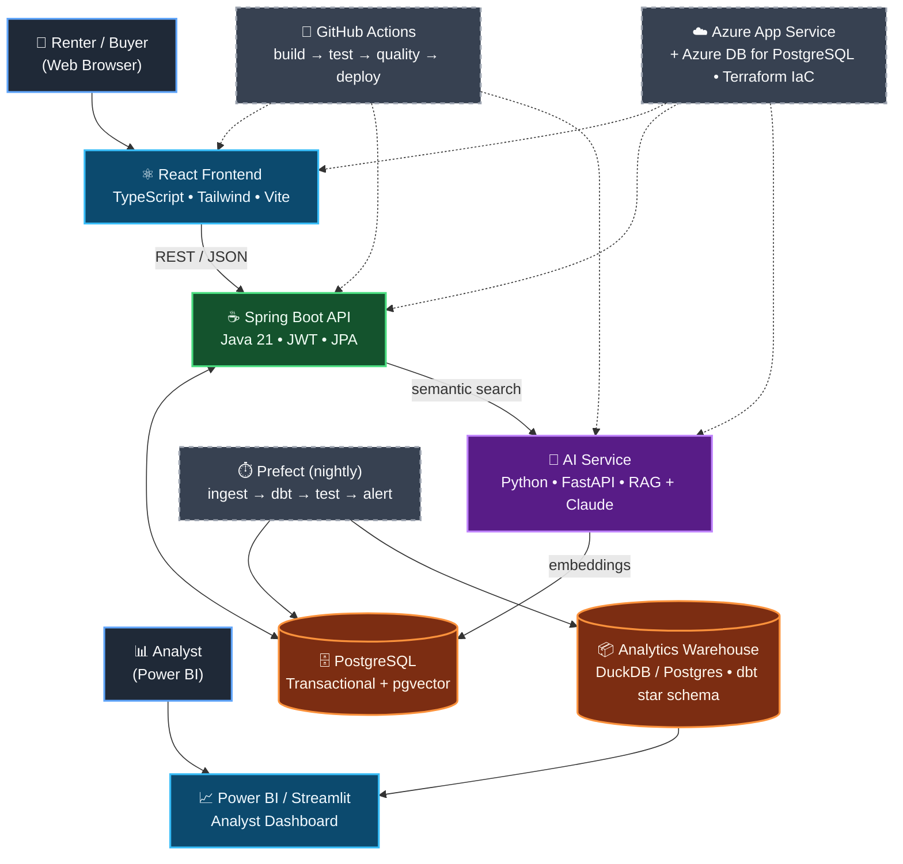

# HomeBase — Cross-Source Housing Intelligence Platform

A full-stack housing search platform for Toronto renters and buyers. Search listings by neighbourhood, transit access, and price. Ask natural-language questions powered by RAG + Claude AI.

> **Built for Canadian co-op applications** — covers software engineering, QA, data engineering, analytics, AI, and DevOps.

**[🌐 Live Demo](https://homebase-frontend-54zw.onrender.com)** · [](https://render.com/deploy?repo=https://github.com/beaprogram/Homebase)

---

## Architecture



**Request flow.** Users hit the React SPA, which calls the Spring Boot API for listings and saved-listing operations. Natural-language queries are forwarded to the Python AI service, which performs RAG over pgvector embeddings and synthesizes answers with Claude.

**Data pipeline.** A nightly Prefect flow ingests Toronto Open Data and TTC feeds into Postgres, runs dbt transformations into the analytics warehouse, executes data-quality tests, and feeds the Power BI / Streamlit dashboards for analysts.

**Delivery.** GitHub Actions runs a four-stage pipeline (build → test → quality → deploy) and ships Docker images to Azure App Service. Infrastructure is defined in Terraform.

## Tech Stack

| Layer            | Choice                                    |
|------------------|-------------------------------------------|
| Frontend         | React 18 + TypeScript + Tailwind + Vite   |
| Backend          | Java 21 + Spring Boot 3.3 + Spring Data JPA|
| Auth             | JWT (JJWT 0.12)                           |
| AI Service       | Python 3.12 + FastAPI + Claude API (RAG)  |
| Embeddings       | sentence-transformers all-MiniLM-L6-v2    |
| Transactional DB | PostgreSQL 16 + pgvector                  |
| Warehouse        | DuckDB (dev) / Postgres (prod)            |
| Transformations  | dbt-core                                  |
| Orchestration    | Prefect 3.x (nightly schedule)            |
| BI               | Power BI / Streamlit                      |
| Tests            | JUnit 5 + Mockito, pytest, Vitest + RTL   |
| E2E              | Playwright                                |
| Load             | k6                                        |
| Containers       | Docker + docker-compose                   |
| CI/CD            | GitHub Actions (4-stage pipeline)         |
| Cloud            | Azure App Service + Container Registry    |
| Monitoring       | Azure Application Insights                |
| IaC              | Terraform                                 |

---

## Getting Started

### Prerequisites
- Docker + Docker Compose
- Java 21 + Maven (for local backend dev)
- Node 20 (for local frontend dev)
- Python 3.12 (for AI service / ingestion)

### Run locally with Docker Compose

```bash
# Clone and start everything
git clone https://github.com/beaprogram/Homebase.git
cd HomeBase
cp .env.example .env   # add ANTHROPIC_API_KEY for AI Q&A

docker-compose up --build

# App will be available at:
# Frontend:   http://localhost:3000
# Backend API: http://localhost:8080/swagger-ui.html
# AI Service:  http://localhost:8000/docs
```

### Seed real Toronto data

```bash
cd data/ingestion
pip install -r requirements.txt

# Pull ~500 affordable rental listings from Toronto Open Data
python ingest_toronto.py

# Seed TTC transit stops
python ingest_transit.py

# Generate vector embeddings for AI search (requires ~2GB RAM for model)
python seed_embeddings.py
```

### Run dbt models

```bash
cd data/dbt
pip install dbt-postgres
dbt run
dbt test
```

---

## Project Structure

```
HomeBase/
├── backend/              # Spring Boot Java API
│   ├── src/main/java/com/homebase/
│   │   ├── controller/   # AuthController, ListingController, SavedListingController
│   │   ├── service/      # Business logic
│   │   ├── repository/   # JPA repositories with custom JPQL filters
│   │   ├── model/        # User, Listing, SavedListing entities
│   │   ├── security/     # JWT filter, UserDetailsService
│   │   └── config/       # Security, OpenAPI, GlobalExceptionHandler
│   └── src/test/         # JUnit 5 + Mockito unit + WebMvcTest controller tests
├── frontend/             # React TypeScript app
│   ├── src/
│   │   ├── pages/        # HomePage, ListingDetailPage, SavedPage, Login, Register
│   │   ├── components/   # Layout, ListingCard, SearchFilters, AskPanel
│   │   ├── hooks/        # TanStack Query hooks
│   │   ├── api/          # Axios API client with JWT interceptor
│   │   └── store/        # Zustand auth store
│   └── src/test/         # Vitest + Testing Library component tests
├── ai-service/           # Python FastAPI RAG service
│   └── app/
│       ├── routers/      # POST /ask endpoint
│       └── services/     # embedding.py, retrieval.py, llm.py
├── data/
│   ├── dbt/              # Staging + mart models, schema tests
│   ├── ingestion/        # Toronto Open Data + TTC ingestors, embedding seeder
│   └── orchestration/    # Prefect nightly flow
├── infra/                # Terraform for Azure
├── playwright/           # E2E tests (configured separately)
└── .github/workflows/    # 4-stage CI/CD pipeline
```

---

## API Reference

### Authentication
```
POST /api/auth/register   { name, email, password }  → { token, email, name }
POST /api/auth/login      { email, password }         → { token, email, name }
```

### Listings (public)
```
GET /api/listings?neighbourhood=Annex&type=RENTAL&minPrice=1500&maxPrice=2500&minBedrooms=1&page=0&size=20
GET /api/listings/{id}
```

### Saved Listings (requires Bearer token)
```
GET    /api/saved-listings
POST   /api/saved-listings/{listingId}
DELETE /api/saved-listings/{listingId}
```

### AI Service
```
POST /ask   { query: "2-bedroom near subway under $2500", top_k: 5 }
          → { answer: string, listings: [...], query_time_ms: float }
```

Full OpenAPI spec at `/swagger-ui.html` when running locally.

---

## Testing

```bash
# Backend unit + integration tests
cd backend && mvn test

# Frontend component tests with coverage
cd frontend && npm run test:coverage

# AI service tests
cd ai-service && pytest

# Data ingestion tests
cd data/ingestion && pytest

# dbt data quality tests
cd data/dbt && dbt test
```

---

## CI/CD Pipeline

Four stages, runs on every PR:

1. **Build** — Maven build, `npm run build`, Python deps install
2. **Test** — JUnit tests against real Postgres (Testcontainers), pytest, Vitest
3. **Quality** — JaCoCo coverage, ESLint, ruff
4. **Deploy** — Push images to Azure Container Registry → deploy to App Service (main branch only)

---

## Deploy to Render (one click)

[](https://render.com/deploy?repo=https://github.com/beaprogram/Homebase)

Render reads `render.yaml` and provisions everything automatically:

| Service | Type | Notes |
|---|---|---|
| `homebase-backend` | Web Service (Docker) | Spring Boot; Flyway auto-migrates + seeds DB |
| `homebase-frontend` | Static Site | React build, CDN-delivered, HTTPS |
| `homebase-ai` | Web Service (Docker) | FastAPI RAG; embedding model pre-baked |
| `homebase-db` | PostgreSQL | 20 listings seeded automatically on first boot |

**After deploy (~5 min):**
1. Copy the `homebase-backend` URL from the Render dashboard (e.g. `https://homebase-backend.onrender.com`)
2. Go to `homebase-frontend` → **Environment** → set `VITE_API_BASE_URL` to that URL → **Manual Deploy**
3. Optionally set `ANTHROPIC_API_KEY` on `homebase-ai` to enable the AI Q&A panel

> Free tier services sleep after 15 min inactivity — first request takes ~30s to wake. Upgrade to Starter ($7/mo) for always-on.

---

## Cloud Deployment (Azure)

Infrastructure defined in `infra/` using Terraform:

- **Azure App Service** (Linux) for backend, frontend, AI service
- **Azure Database for PostgreSQL Flexible Server** (16)
- **Azure Container Registry** for Docker images
- **Azure Application Insights** for monitoring

```bash
cd infra
cp terraform.tfvars.example terraform.tfvars  # fill in real values
terraform init
terraform plan
terraform apply
```

---

## Data Pipeline

Nightly Prefect flow (`data/orchestration/flow.py`):
1. Pull ~500 listings from Toronto Open Data Affordable Rental Housing API
2. Seed TTC transit stops
3. `dbt run` — build staging views + mart tables
4. `dbt test` — run 20+ data quality assertions
5. Slack alert on failure
